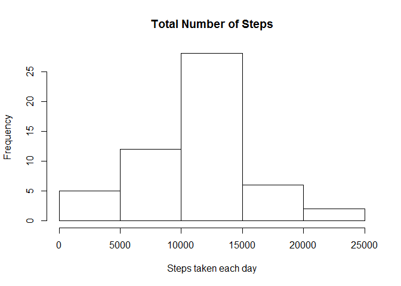
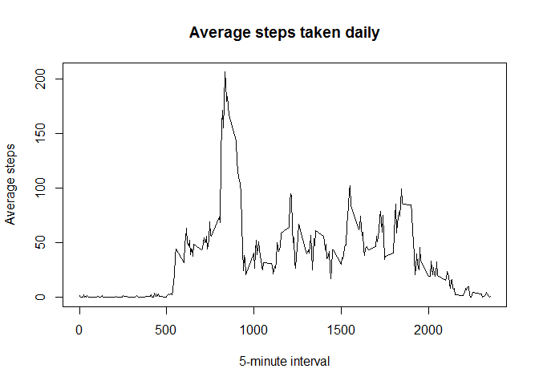
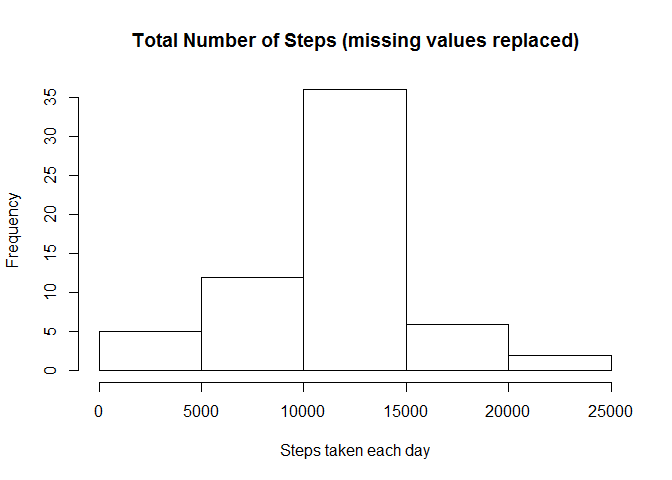
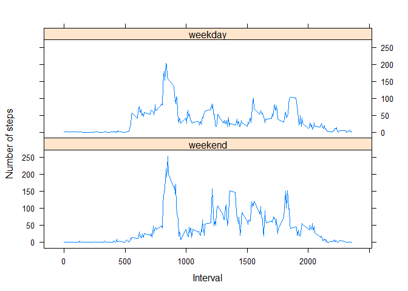

# Reproducible Research: Peer Assessment 1


## Loading and preprocessing the data

1. Load the data


```r
setwd("~/R/Coursera/repdata/week2/RepData_PeerAssessment1")
activity <- read.csv(unz("activity.zip", "activity.csv"))
```

2. Process/transform the data into a format suitable for the analysis

## What is mean total number of steps taken per day?

1. Make a histogram of the total number of steps taken each day


```r
totalSteps <- aggregate(steps ~ date, data = activity, sum, na.rm = TRUE)
hist(totalSteps$steps, main = "Total Number of Steps", xlab = "Steps taken each day",)
```

 

2. Calculate and report the mean and median total number of steps taken per day


```r
totalStepsMean = as.integer(mean(totalSteps$steps))
totalStepsMedian = median(totalSteps$steps)
```
* The **mean** total number of steps taken per day is 
    10766 steps.
* The **median** total number of steps taken per day is 
    10765 steps.

## What is the average daily activity pattern?

1. Make a time series plot (i.e. type = "l") of the 5-minute interval (x-axis) and the average number of steps taken, averaged across all days (y-axis)


```r
avgStepsTaken <- aggregate(steps ~ interval, data = activity, mean, na.rm = TRUE)
plot(steps ~ interval, data = avgStepsTaken, type="l", xlab = "5-minute interval", 
    ylab = "Average steps", main = "Average steps taken daily")
```

 

2. Which 5-minute interval, on average across all the days in the dataset, contains the maximum number of steps?


```r
maxAvgStepsTaken = avgStepsTaken[which.max(avgStepsTaken$steps), ]$interval
```

The interval containing the maximum average number of steps is the **835th** interval.

## Imputing missing values

1. Calculate and report the total number of missing values in the dataset (i.e. the total number of rows with `NA`s)


```r
sumStepsMissing = sum(is.na(activity$steps))
```

The total number of missing values is **2304**.

2. Devise a strategy for filling in all of the missing values in the dataset. The strategy does not need to be sophisticated. For example, you could use the mean/median for that day, or the mean for that 5-minute interval, etc.

**My strategy for filling in the dataset is to replace NA with the mean for that 5-minute interval.**

3. Create a new dataset that is equal to the original dataset but with the missing data filled in.


```r
activity.MissingReplaced <- activity
for (i in 1:nrow(activity.MissingReplaced)) {
    if (is.na(activity.MissingReplaced[i, ]$steps)) {
        interval = activity.MissingReplaced[i, ]$interval
        intervalAverage = avgStepsTaken[avgStepsTaken$interval == interval, ]$steps
        activity.MissingReplaced[i, ]$steps <- round(intervalAverage, digits = 0)
    }
}
```

4. Make a histogram of the total number of steps taken each day and Calculate and report the **mean** and **median** total number of steps taken per day. Do these values differ from the estimates from the first part of the assignment? What is the impact of imputing missing data on the estimates of the total daily number of steps?


```r
totalSteps.MissingReplaced <- aggregate(steps ~ date, data = activity.MissingReplaced, sum)
hist(totalSteps.MissingReplaced$steps, main = "Total Number of Steps (missing values replaced)", xlab = "Steps taken each day",)
```

 

2. Calculate and report the mean and median total number of steps taken per day


```r
totalStepsMean.MissingReplaced = as.integer(mean(totalSteps.MissingReplaced$steps))
totalStepsMedian.MissingReplaced = median(totalSteps.MissingReplaced$steps)
```

* The **mean** total number of steps taken per day (missing values replaced) is 
    10765 steps.
* The **median** total number of steps taken per day (missing values replaced) is 
    1.0762\times 10^{4} steps.

## Are there differences in activity patterns between weekdays and weekends?

1. Create a new factor variable in the dataset with two levels -- "weekday" and "weekend" indicating whether a given date is a weekday or weekend day.


```r
activity.MissingReplaced$day <- as.POSIXlt(as.Date(activity.MissingReplaced$date))$wday > 4
activity.MissingReplaced$day <- ifelse(activity.MissingReplaced$day, "weekend", "weekday")
activity.MissingReplaced$day <- factor(activity.MissingReplaced$day, levels=c("weekend", "weekday"))
```

2. Make a panel plot containing a time series plot (i.e. `type = "l"`) of the 5-minute interval (x-axis) and the average number of steps taken, averaged across all weekday days or weekend days (y-axis). The plot should look something like the following, which was created using **simulated data**:


```r
avgStepsTaken.WeekdayWeekend <- aggregate(steps~interval+day, activity.MissingReplaced, mean)

library(lattice)
xyplot(steps ~ interval | factor(day),data = avgStepsTaken.WeekdayWeekend, 
       layout = c(1, 2), type = "l", xlab = "Interval", ylab = "Number of steps")
```

 
